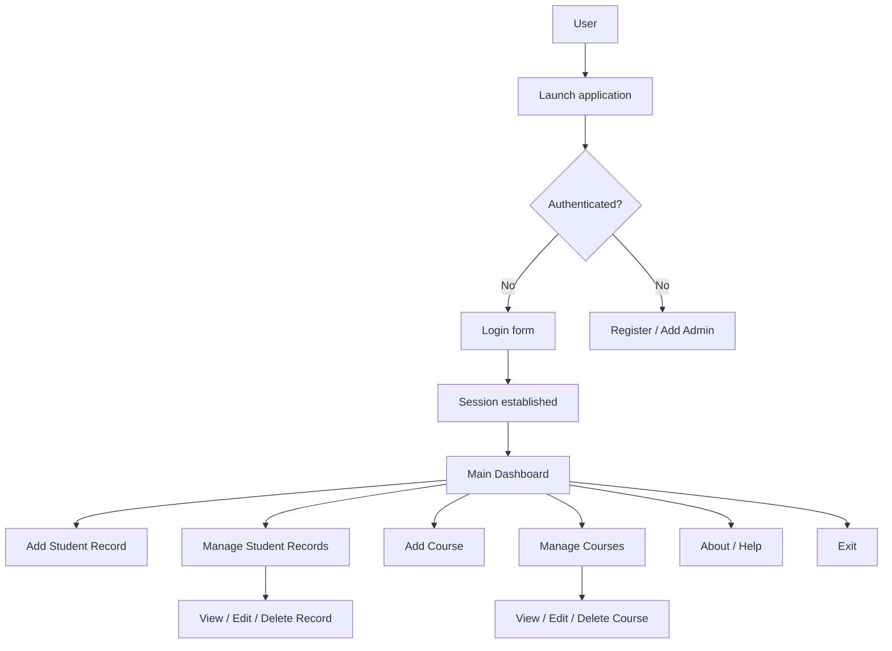

<p align="center">
	<a href="https://www.flaticon.com/free-icon/systems_11443881?term=information+system&page=1&position=9&origin=tag&related_id=11443881" title="Systems icon (attribution)">
		
	</a>
</p>

<h1 align="center">Student Information System</h1>

<p align="center"><i>Desktop-based Java application for managing students, courses, and academic records.</i></p>

<p align="center">
	
	
	
</p>

<p align="center">
	
	
	
	
</p>

<p align="center">
	<a href="#-project-intro"></a>
	<a href="#-project-structure"></a>
	<a href="#-run-the-project"></a>
</p>

## Student Information System — README

Student Information System is a Java Swing desktop application focused on academic record management, including student registration, course management, and result tracking.

## Table of Contents

- [🚀 Project intro](#-project-intro)
- [🔧 Features](#-features)
- [📁 Project structure](#-project-structure)
- [🧰 Tech stack](#-tech-stack)
- [⚙️ Prerequisites](#️-prerequisites)
- [▶️ Run the project](#️-run-the-project)
- [📄 License](#-license)

## 🚀 Project intro

This project helps institutions and administrators to:

- Add student records
- Manage and update student records
- Add and manage courses
- View and maintain student result information

The application uses Java Swing forms and a database connection layer through `MyConnection.java`.

## 🔧 Features

- Login screen for system access
- Add new student records
- Manage existing student records
- Add courses and manage course lists
- Basic dashboard and count utilities
- About and navigation forms for desktop workflow

### Core features

| Feature | Status | Notes |
| --- | --- | --- |
| Credentials auth (login) | ✅ Current | Email/password login with basic session handling |
| Add student records | ✅ Current | Form-based entry with validation |
| Manage student records | ✅ Current | Edit, delete, and search existing records |
| Add courses | ✅ Current | Create course entries and metadata |
| Manage courses | ✅ Current | Edit/delete course lists |
| Database connection | ✅ Current | MySQL via `MyConnection.java` |
| Counts & dashboard | ✅ Current | `Count.java` utilities for quick stats |
| About & help screens | ✅ Current | `About.java` and navigation forms |

### Flow diagram

The flow below shows the main desktop application journey from launch through authentication and record management.



## 📁 Project structure

```txt
Student-Information-System/
├── build.xml
├── manifest.mf
├── README.md
├── nbproject/
└── src/
	├── About.java
	├── AddCourse.java
	├── AddStudentRecord.java
	├── Count.java
	├── LoginForm.java
	├── MainForm.java
	├── ManageCourse.java
	├── ManageStudentRecord.java
	├── MyConnection.java
	├── Student.java
	└── Image/
```

## 🧰 Tech stack

- **Language:** Java
- **UI:** Java Swing
- **Build Tool:** Apache Ant (`build.xml`)
- **Project Format:** NetBeans project (`nbproject`)
- **Database:** MySQL (via `MyConnection.java`)

## ⚙️ Prerequisites

- JDK 8 or newer
- NetBeans IDE (recommended)
- MySQL Server
- Proper database configuration in `src/MyConnection.java`

## ▶️ Run the project

### Option 1: NetBeans (recommended)

1. Open NetBeans.
2. Import/open the `Student-Information-System` project folder.
3. Configure the database connection values in `src/MyConnection.java`.
4. Build and run the project from the IDE.

### Option 2: Command line (Ant)

```bash
ant clean
ant
```

Then run the generated application from your build output using your Java runtime.

## 📄 License

This project is licensed under the MIT License.
See `LICENSE` for details.
